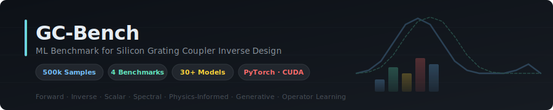
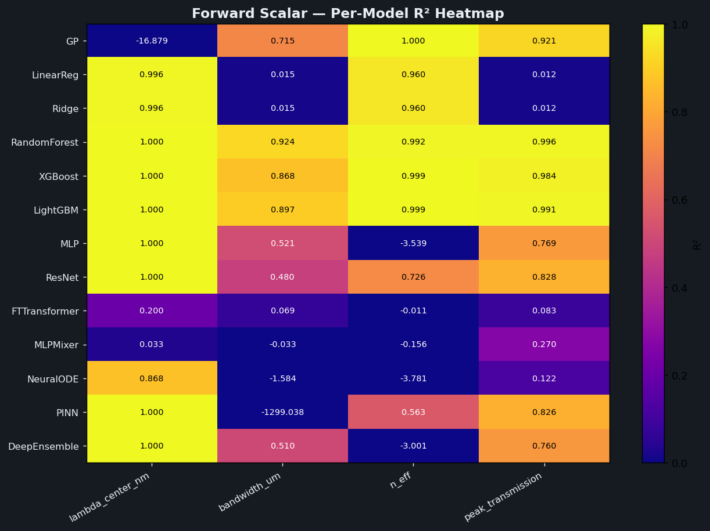
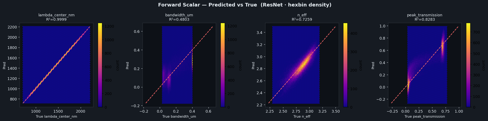
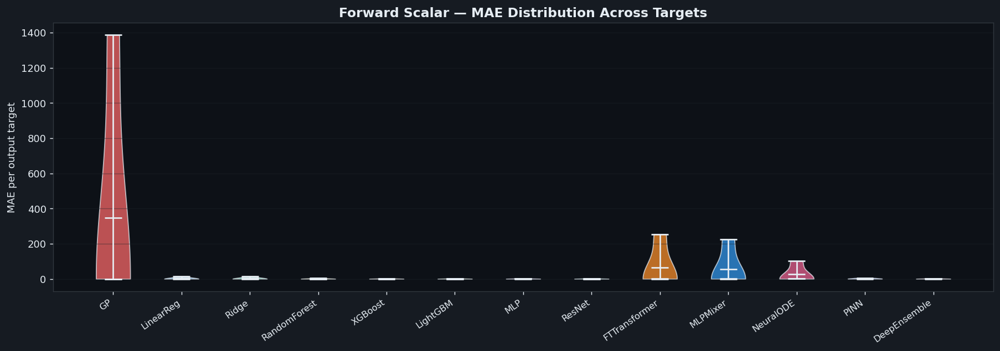
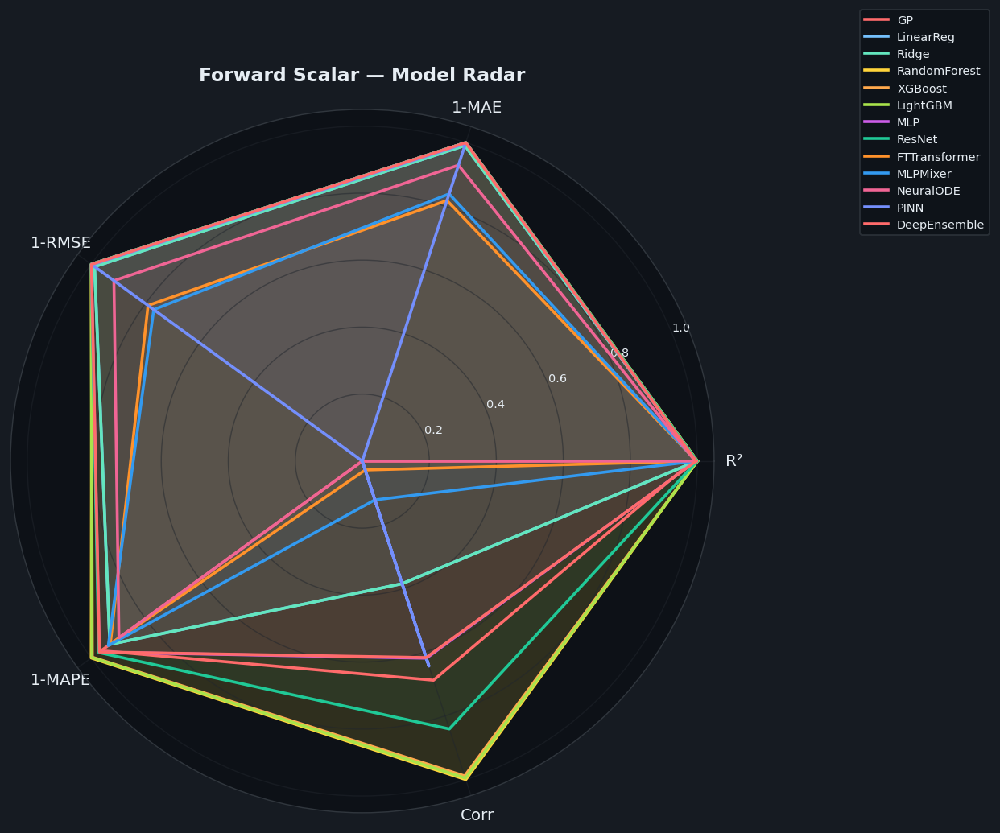
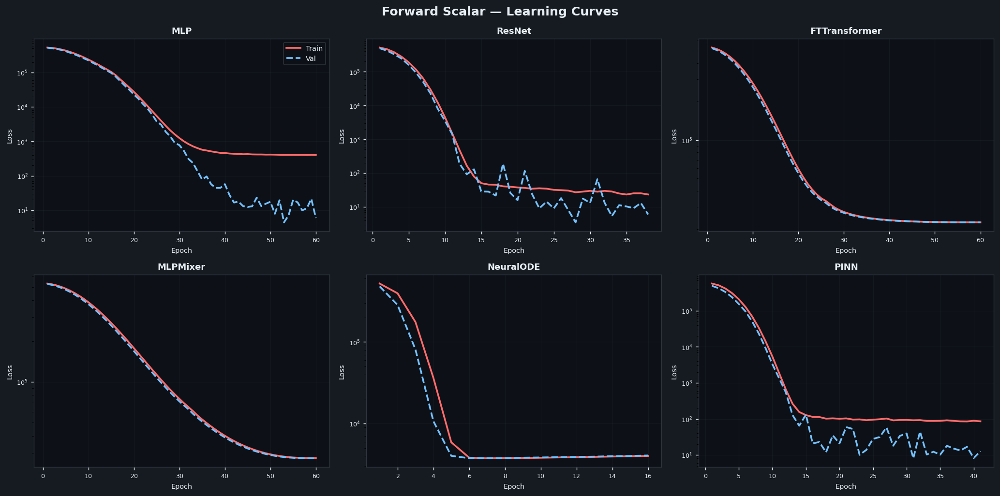
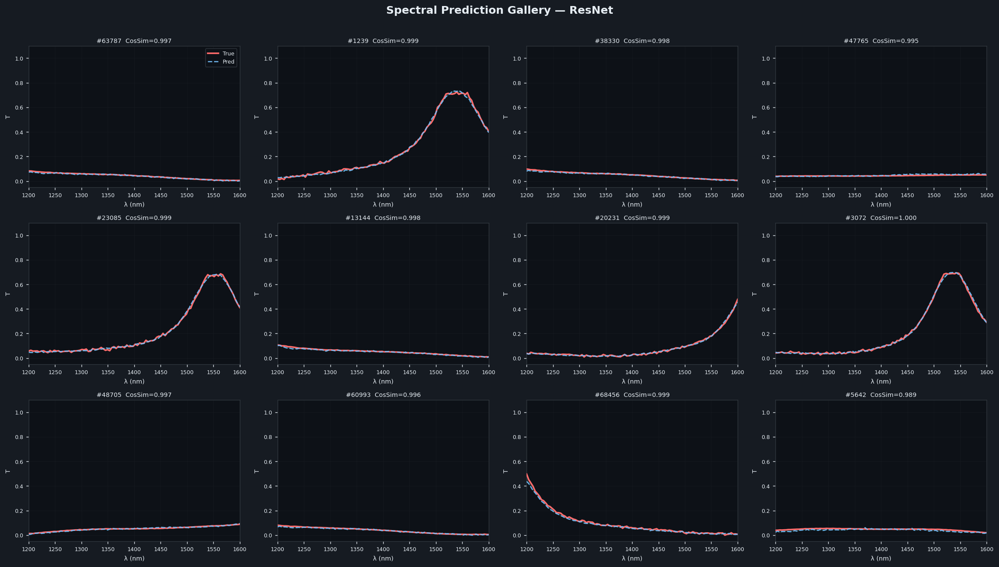
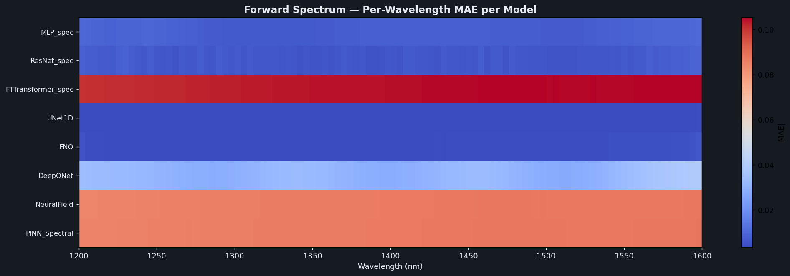

<div align="center">



# GC-Bench: A Comprehensive ML Benchmark for Silicon Grating Coupler Design

[](https://www.python.org/downloads/)
[](https://pytorch.org/)
[](LICENSE)
[](https://www.kaggle.com/datasets/drahulray/syn-data)
[](https://kaggle.com)

**A systematic, reproducible benchmark evaluating 30+ ML architectures across four photonic inverse design tasks — from scalar regression to diffusion-based geometry recovery.**

[**Paper**](#citation) · [**Dataset**](#dataset) · [**Results**](#benchmark-results) · [**Quickstart**](#quickstart) · [**Models**](#model-zoo)

</div>

---

## Overview

GC-Bench provides a rigorous, apples-to-apples comparison of machine learning models for **silicon photonic grating coupler design**. Grating couplers are critical interface components for chip-to-fiber coupling, and their inverse design is a canonical hard problem: the mapping from desired optical response to device geometry is **non-unique, high-dimensional, and physically constrained**.









We benchmark models across four complementary tasks spanning the full forward–inverse design loop on **500,000 simulated grating coupler geometries**.

```
Geometry (5 params) ──forward──▶  Optical Scalars (4 metrics)
                    ──forward──▶  Transmittance Spectrum (100 pts)

Optical Scalars   ──inverse──▶  Geometry (5 params)
Spectrum          ──inverse──▶  Geometry (5 params)
```

### Key Findings

- 🏆 **Forward scalar**: Tree ensembles (RF R²=0.978, XGB R²=0.963) outperform all deep learning models, including physics-informed variants
- 📡 **Forward spectrum**: Operator-learning architectures shine — UNet1D achieves **CosSim=0.9996**, DTW=0.014, peak-wavelength error of only **6.4 nm**
- 🔄 **Inverse design is fundamentally ill-posed**: best strict-5% success rate is only **3.9%** (ResNet), confirming the non-uniqueness of the photonic inverse problem
- 🌊 **Generative models underperform** deterministic regressors on inverse tasks — diffusion models achieve 0.0% SR vs. ResNet's 3.9%
- 🔊 **Noise robustness**: SR degrades gracefully from 4.0% → 2.3% as spectrum noise σ increases from 0.001 → 0.05

---

## Dataset

| Property | Value |
|---|---|
| Total samples | 500,000 |
| Train / Val / Test | 350k / 75k / 75k |
| Geometry parameters | 5 |
| Spectral resolution | 100 wavelength points |
| Wavelength range | 1200–1700 nm |
| Simulation method | FDTD / EME |
| Valid fraction | ~95% |

### Geometry Parameters

| Parameter | Symbol | Range |
|---|---|---|
| Grating period | `period_nm` | 400–900 nm |
| Fill factor | `fill_factor` | 0.2–0.8 |
| Etch depth | `etch_depth_nm` | 50–300 nm |
| Oxide thickness | `oxide_thickness_nm` | 1000–3000 nm |
| Silicon thickness | `si_thickness_nm` | 200–400 nm |

### Optical Targets

| Target | Description | Unit |
|---|---|---|
| `lambda_center_nm` | Peak transmission wavelength | nm |
| `bandwidth_um` | 3-dB bandwidth | µm |
| `n_eff` | Effective refractive index | — |
| `peak_transmission` | Maximum transmittance | [0, 1] |

---

## Benchmark Tasks

### Task 1 · Forward Scalar `(5 → 4)`
Predict 4 scalar optical metrics from 5 geometry parameters. Evaluates regression fidelity with R², MAE, RMSE, MAPE, Pearson correlation, and dB error on peak transmission.

### Task 2 · Forward Spectrum `(5 → 100)`
Predict the full 100-point transmittance spectrum from geometry. Evaluates spectral fidelity with cosine similarity, SAM, DTW, peak-wavelength error, and per-wavelength correlation.

### Task 3 · Inverse Scalar `(4 → 5)`
Recover geometry from scalar optical targets — the classical inverse design problem. Evaluates with strict (5%) and relaxed (10%) success rates plus per-parameter MAE.

### Task 4 · Inverse Spectrum `(100 → 5)`
Recover geometry from a full transmittance spectrum — the most information-rich inverse task. Includes noise robustness analysis and condition number proxy.

---

## Benchmark Results

> ⚠️ **Training times** are reported for context (single Tesla T4 GPU) but should not be used for comparisons — they depend heavily on hardware and hyperparameter choices.

### Task 1 — Forward Scalar (5 params → 4 scalars)

| Model | R² ↑ | MAE ↓ | RMSE ↓ | MAPE% ↓ | Corr ↑ | dB Err ↓ |
|---|---|---|---|---|---|---|
| GP | −3.561 | 346.46 | 356.59 | 46.96 | 0.768 | 4.938 |
| Linear Regression | 0.496 | 4.027 | 5.394 | 83.89 | 0.552 | 4.621 |
| Ridge | 0.496 | 4.027 | 5.394 | 83.89 | 0.552 | 4.621 |
| **Random Forest** | **0.978** | **1.287** | **1.684** | **4.28** | **0.989** | **0.157** |
| XGBoost | 0.963 | 0.821 | 1.058 | 8.99 | 0.981 | 0.655 |
| LightGBM | 0.972 | 0.805 | 1.034 | 7.29 | 0.986 | 0.303 |
| MLP | −0.312 | 0.849 | 1.170 | 38.78 | 0.718 | 2.961 |
| ResNet | 0.759 | 0.802 | 1.007 | 36.36 | 0.876 | 7.019 |
| FT-Transformer | 0.085 | 63.70 | 75.56 | 85.79 | 0.299 | 4.464 |
| MLP-Mixer | 0.029 | 56.48 | 83.04 | 77.39 | 0.366 | 4.268 |
| Neural ODE | −1.094 | 25.36 | 30.78 | 122.82 | 0.279 | 4.394 |
| PINN | −324.16 | 1.826 | 2.014 | — | — | — |
| Deep Ensemble | — | — | — | — | — | — |

> **Key insight**: Gradient-boosted trees (RF, XGB, LightGBM) dominate this task. Deep learning models underfit despite large training data, likely due to non-smooth geometry–metric relationships.

---

### Task 2 — Forward Spectrum (5 params → 100-pt spectrum)

| Model | MSE ↓ | MAE ↓ | CosSim ↑ | SAM° ↓ | DTW ↓ | PkWL err (nm) ↓ | BW err (nm) ↓ | PW-Corr ↑ |
|---|---|---|---|---|---|---|---|---|
| MLP | 0.00020 | 0.00808 | 0.9970 | 4.16 | 0.034 | 11.99 | 14.71 | 0.9964 |
| ResNet | 0.00009 | 0.00656 | 0.9964 | 4.17 | 0.025 | 20.20 | 13.54 | 0.9986 |
| FT-Transformer | 0.02456 | 0.10377 | 0.8279 | 32.16 | 0.399 | 148.66 | 180.33 | 0.3301 |
| **UNet1D** | **0.00003** | **0.00356** | **0.9996** | **1.60** | **0.014** | **6.38** | **3.11** | **0.9994** |
| FNO | 0.00004 | 0.00394 | 0.9991 | 2.10 | 0.016 | 10.27 | 5.74 | 0.9993 |
| DeepONet | 0.00280 | 0.03147 | 0.9695 | 13.63 | 0.121 | 47.45 | 57.83 | 0.9494 |
| Neural Field | 0.01385 | 0.08655 | 0.9104 | 23.32 | 0.349 | 79.19 | 125.77 | 0.9268 |
| PINN-Spectral | 0.01386 | 0.08668 | 0.9102 | 23.35 | 0.349 | 76.30 | 124.53 | 0.9260 |

> **Key insight**: UNet1D with skip connections achieves near-perfect spectral reconstruction. Operator-learning methods (FNO, DeepONet) are strong; transformer variants struggle with the functional-space structure.

---

### Task 3 — Inverse Scalar (4 scalars → 5 geo params)

| Model | SR Strict 5% ↑ | SR Relaxed 10% ↑ | MAE ↓ | RMSE ↓ | MedAE ↓ | MRE ↓ |
|---|---|---|---|---|---|---|
| XGBoost | 1.5% | 9.3% | 43.75 | 53.88 | 38.24 | 0.110 |
| Random Forest | 2.5% | 13.1% | 38.77 | 49.95 | 30.86 | 0.104 |
| MLP | 2.3% | 12.3% | 40.10 | 50.61 | 33.33 | 0.105 |
| **ResNet** | **3.5%** | **15.7%** | **36.26** | **47.02** | **28.68** | **0.098** |
| FT-Transformer | 0.7% | 6.1% | 50.96 | 64.88 | 44.07 | 0.127 |
| MDN (10 mix) | 0.4% | 3.5% | 63.64 | 81.69 | 50.79 | 0.159 |
| cVAE | 0.0% | 0.8% | 74.74 | 92.16 | 65.47 | 0.213 |
| Normalizing Flow | 0.0% | 0.3% | 90.42 | 108.17 | 82.45 | 0.263 |
| PINN | 0.7% | 5.3% | 51.65 | 62.83 | 46.52 | 0.130 |

> **Key insight**: All models achieve <4% strict success rate, confirming the fundamental non-uniqueness of inverse design from scalar targets. Generative models (cVAE, Flow) underperform deterministic regressors — their diversity hurts point-estimate accuracy.

---

### Task 4 — Inverse Spectrum (100-pt spectrum → 5 geo params)

| Model | SR Strict 5% ↑ | SR Relaxed 10% ↑ | MAE ↓ | RMSE ↓ | MedAE ↓ | Cond. Proxy ↓ |
|---|---|---|---|---|---|---|
| MLP | 2.1% | 10.8% | 49.23 | 59.43 | 44.99 | 0.001 |
| **ResNet** | **3.9%** | **15.9%** | **43.42** | **53.11** | **38.33** | **0.001** |
| CNN-1D | 0.2% | 3.3% | 60.93 | 73.82 | 55.28 | 0.002 |
| FT-Transformer | 1.2% | 8.8% | 51.88 | 66.47 | 43.42 | 0.001 |
| INN | 1.1% | 7.9% | 52.14 | 64.27 | 46.09 | 0.001 |
| Deep Ensemble (CNN) | 0.3% | 3.5% | 60.60 | 73.47 | 54.92 | 0.002 |
| Tandem Network | 0.3% | 3.2% | 68.69 | 88.03 | 54.84 | 0.003 |
| cVAE | 0.1% | 0.9% | 79.78 | 98.23 | 70.38 | 0.001 |
| DDPM Diffusion | 0.0% | 0.4% | 87.36 | 105.23 | 78.72 | 0.002 |

#### Noise Robustness (ResNet, Task 4)

| Noise σ | SR Strict % ↑ | MAE ↓ |
|---|---|---|
| 0.001 | 4.0% | 43.37 |
| 0.005 | 3.8% | 43.80 |
| 0.010 | 3.6% | 44.96 |
| 0.020 | 3.2% | 48.39 |
| 0.050 | 2.3% | 59.47 |

> **Key insight**: More spectral information (100 points vs. 4 scalars) does not dramatically improve inverse design success rates, confirming that the challenge is fundamental non-uniqueness, not information bottleneck.

---

## Model Zoo

### Forward Models

| Model | Type | Task | Notes |
|---|---|---|---|
| `LinearRegression` | Linear | Scalar | Baseline |
| `Ridge` | Linear | Scalar | L2 regularized |
| `RandomForest` | Tree Ensemble | Scalar | Best scalar forward model |
| `XGBoost` | Gradient Boosting | Scalar | GPU accelerated |
| `LightGBM` | Gradient Boosting | Scalar | |
| `GP` | Gaussian Process | Scalar | Subset training (3k) |
| `MLP` | Deep | Both | BatchNorm + GELU |
| `ResNet` | Deep | Both | Residual blocks |
| `FTTransformer` | Deep | Both | Feature tokenizer |
| `MLPMixer` | Deep | Scalar | Token mixing |
| `NeuralODE` | Deep | Scalar | Continuous dynamics |
| `PINN` | Physics-informed | Both | Physics residual loss |
| `UNet1D` | Deep | Spectrum | **Best spectrum model** |
| `FNO` | Operator Learning | Spectrum | Fourier Neural Operator |
| `DeepONet` | Operator Learning | Spectrum | Branch-trunk architecture |
| `NeuralField` | Implicit | Spectrum | Coordinate-conditioned |
| `DeepEnsemble` | Ensemble | Scalar | 5× MLP ensemble |

### Inverse Models

| Model | Type | Task | Notes |
|---|---|---|---|
| `ResNet` | Deterministic | Both | **Best inverse model** |
| `MLP` | Deterministic | Both | |
| `FTTransformer` | Deterministic | Both | |
| `XGBoost` / `RF` | Tree | Scalar | |
| `MDN` | Probabilistic | Scalar | 10-component mixture |
| `cVAE` | Generative | Both | β=0.5 |
| `RealNVP` | Flow | Scalar | 8 affine coupling layers |
| `INN` | Invertible NN | Spectrum | Padded affine blocks |
| `DDPM` | Diffusion | Spectrum | T=200 steps |
| `TandemNet` | Two-stage | Spectrum | Frozen forward + inverse |
| `PINN` | Physics-informed | Scalar | Physics consistency loss |

---

## Quickstart

### Installation

```bash
git clone https://github.com/yourusername/gc-benchmark.git
cd gc-benchmark
pip install -e .
```

Or install dependencies directly:

```bash
pip install -r requirements.txt
```

### Dataset

Download the dataset from Kaggle:

```bash
kaggle datasets download drahulray/syn-data
```

Or set the path in `configs/default.yaml`:

```yaml
data_path: /path/to/gc_500k_20251213_152525.h5
```

### Run All Benchmarks

```bash
# Full benchmark suite
bash scripts/run_all.sh

# Individual tasks
python scripts/bench_forward_scalar.py
python scripts/bench_forward_spectrum.py
python scripts/bench_inverse_scalar.py
python scripts/bench_inverse_spectrum.py
```

### Run from Notebooks

```bash
jupyter notebook notebooks/01_forward_scalar.ipynb
```

### Quick Evaluation

```python
from gc_bench import CFG, load_data, run_benchmark

cfg = CFG(data_path="/path/to/data.h5")
data = load_data(cfg)

# Run forward scalar benchmark
results = run_benchmark("fwd_scalar", data, cfg)
```

---

## Repository Structure

```
gc-benchmark/
│
├── README.md                    # This file
├── LICENSE                      # MIT License
├── requirements.txt             # Python dependencies
├── setup.py                     # Package install
│
├── configs/
│   └── default.yaml             # Default hyperparameters
│
├── gc_bench/                    # Core library
│   ├── __init__.py
│   ├── config.py                # CFG dataclass
│   ├── data.py                  # HDF5 loading & splitting
│   ├── metrics.py               # All evaluation metrics
│   ├── training.py              # Generic train loop
│   ├── visualization.py         # Plotting utilities (light/dark)
│   └── models/
│       ├── __init__.py
│       ├── classical.py         # GP, Linear, RF, XGB, LGB
│       ├── deep.py              # MLP, ResNet, FTT, Mixer, ODE
│       ├── spectral.py          # UNet1D, FNO, DeepONet, NeuralField
│       ├── generative.py        # MDN, cVAE, RealNVP, DDPM, INN
│       └── physics.py           # PINN forward/inverse
│
├── scripts/
│   ├── run_all.sh               # End-to-end benchmark
│   ├── bench_forward_scalar.py
│   ├── bench_forward_spectrum.py
│   ├── bench_inverse_scalar.py
│   └── bench_inverse_spectrum.py
│
├── notebooks/
│   ├── 01_forward_scalar.ipynb
│   ├── 02_forward_spectrum.ipynb
│   ├── 03_inverse_scalar.ipynb
│   └── 04_inverse_spectrum.ipynb
│
├── results/
│   └── README.md                # Full results tables
│
└── assets/
    └── banner.svg
```

---

## Metrics Reference

### Forward Metrics

| Metric | Formula | Notes |
|---|---|---|
| R² | 1 − SS_res/SS_tot | Per-output, then averaged |
| MAE | mean\|ŷ − y\| | Per-output |
| RMSE | √MSE | Per-output |
| MAPE | mean\|ŷ − y\|/\|y\| × 100 | Per-output |
| Pearson r | corr(ŷ, y) | Per-output |
| dB Error | mean\|10log₁₀(ŷ₄) − 10log₁₀(y₄)\| | Peak transmission only |
| CosSim | (ŷ·y)/(‖ŷ‖‖y‖) | Per spectrum |
| SAM | arccos(CosSim) in degrees | Spectral Angle Mapper |
| DTW | Dynamic Time Warping | Sub-sampled ×10 |
| PkWL err | \|λ(argmax ŷ) − λ(argmax y)\| | Peak wavelength error (nm) |

### Inverse Metrics

| Metric | Definition |
|---|---|
| SR strict | % samples with all-param error < 5% |
| SR relaxed | % samples with all-param error < 10% |
| SR per-param | Per-parameter success rate at 5% |
| MedAE | Median absolute error per parameter |
| MRE | Mean relative error per parameter |
| Cond. Proxy | Median ‖ΔX‖/‖ΔY‖ — local ill-posedness |

---

## Reproducibility

All experiments use:
- **Random seed**: 42
- **Train/Val/Test split**: 70% / 15% / 15% (stratified)
- **Optimizer**: AdamW (lr=1e-3, wd=1e-4)
- **Scheduler**: Cosine Annealing
- **Early stopping**: patience=10 epochs
- **Batch size**: 4096
- **Max epochs**: 60
- **Hardware**: 2× Tesla T4 (16 GB each)

Set `FORCE=True` to retrain from scratch, or `FORCE=False` to load checkpoints.

---

## Limitations & Future Work

- **Non-uniqueness**: The inverse problem is fundamentally ill-posed. Success rates < 5% reflect this, not model failure. Future work should explore solution-space characterization rather than point estimates.
- **Conditional generation**: Learned samplers (cVAE, Flow) could significantly improve with better conditioning and likelihood-free inference methods like SNPE or SBC.
- **Transfer to fabrication**: Simulated data may not capture fabrication variations. Domain adaptation experiments are left for future work.
- **Larger architectures**: Training was limited to 60 epochs on T4 GPUs. Larger models (e.g., vision transformers adapted for physics) may unlock better performance.

---

## Citation

If you use GC-Bench in your research, please cite:

```bibtex
@misc{gcbench2025,
  title     = {GC-Bench: A Comprehensive Machine Learning Benchmark
               for Silicon Grating Coupler Inverse Design},
  author    = {Ray, Ahulray and et al.},
  year      = {2025},
  note      = {GitHub repository},
  url       = {https://github.com/yourusername/gc-benchmark}
}
```

---

## License

This project is licensed under the MIT License — see [LICENSE](LICENSE) for details.

The dataset is hosted on Kaggle under its respective terms of use.

---

<div align="center">
<sub>Built with ❤️ for the photonics + ML community</sub>
</div>
